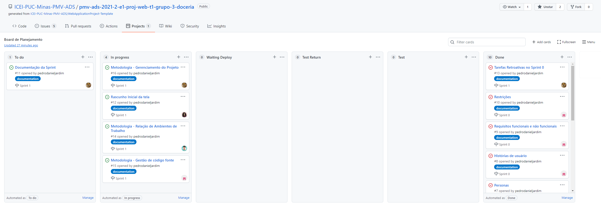

# Metodologia

A metodologia contempla as definições de ferramentas utilizadas pela equipe tanto para a manutenção dos códigos e demais artefatos quanto para a organização do time na execução das tarefas do projeto.

Para controle do projeto, das pessoas e das tarefas, utilizaremos poucos ambientes de trabalho, afim de reduzir/anular as possibilidades de redundância ou ausência de informações em determinados ambientes, focando sempre nos nossos requisitos funcionais.  

Nossa ferramenta principal para gerir os tópicos citados acima, será o GitHub, que utilizaremos na sua forma típica de repositório, armazenando toda manutenção dos códigos. Paralelo a esta modalidade de repositório, faremos uso do GitHub para os gerenciamentos de backlog do produto, bem como, das sprints individualizadas, este gerenciamento será feito através da aba “Project”.  

Para arquivos visuais e sonoros, bem como, formulários de pesquisas,  análises de requisitos, casos de uso, utilizaremos o Google Drive com acesso restrito para a equipe envolvida no desenvolvimento da aplicação, seja através da forma técnica ou gerencial.  

O Projeto de interface e wireframes foi desenvolvido através dos sites Canva e Flowmapp, criado de forma que qualquer eventual alteração ou incrementação seja feita de forma pratica e elegante.

## Relação de Ambientes de Trabalho 

Os artefatos do projeto são desenvolvidos a partir de diversas plataformas e a relação dos ambientes com seu respectivo propósito é apresentada na tabela que se segue: 

|Ambiente| Plataforma |Link de Acesso                 |
|--------------------|------------------------------------|----------------------------------------|
|Repositório de código fonte   |GitHub | https://github.com/ICEI-PUC-Minas-PMV-ADS/pmv-ads-2021-2-e1-proj-web-t1-grupo-3-doceria                |
|Documentos do projeto  | Google Drive | https://drive.google.com/drive/folders/1YY1RS0mlls9j5LWeV0uz-eTcIwJtIJmp?usp=sharing  |
|Projeto de Interface e  Wireframes   | Canva | https://www.canva.com/design/DAEqmxi0SVc/d0ZA0JH-XzNjsNuZ5GmPdA/view?mode=prototype#home-page  |
|Gerenciamento do Projeto   | GitHub Project  | https://github.com/ICEI-PUC-Minas-PMV-ADS/pmv-ads-2021-2-e1-proj-web-t1-grupo-3-doceria/projects/2 |

## Gestão de código fonte / Controle de Versão

A gestão de código fonte ou controle de versões diz respeito ao monitoramento e gerenciamento das alterações no código, de preferência com histórico de execuções de desenvolvimento e, também, auxilia na resolução de conflitos e reverte versões anteriores de um projeto, quando necessário. Esse componente é essencial para o processo de desenvolvimento do software. 

Com isso, para gestão do código fonte utilizaremos o Git Flow, um modelo de organização de branches, o qual dita que tipos de ramificações configurar e como fazer merge. Desta forma, todas as manutenções no código são realizadas em branches separados, identificados como Main, Hotfix, Release, Develop e Feature, ou seja, um modelo de ramificação de manutenção que permite corrigir com rapidez lançamentos de produção mantendo uma linha de desenvolvimento dedicada para atualização de segurança, permitindo que a equipe trabalhe com problemas sem interromper o fluxo do trabalho ou esperar o próximo ciclo de lançamento. Segue figura 1: 

 
 
 Figura 1 - Fluxo de controle do código fonte no repositório github 

    
                                                                                                                              

**Main**: branch principal, somente versão de produção; 

**Hotfix**:  branch de correção: responsável pela realização de alguma correção crítica encontrada em produção; 

**Release**: branch de lançamento: utilizada como ambiente de homologação e é removida após realizar os testes e do merge com a Main. Caso haja alguma alteração, ela também deve ser sincronizada com a Develop; 

**Develop**: branch criada a partir da branch main, contém código em nível preparatório para o próximo deploy/versão. Ou seja, quando features são terminadas, elas são juntadas com a branch develop, testadas e somente depois as atualizações da branch develop passam por mais um processo para então ser juntadas com a branch main; 

**Feature**: branch de melhorias: utiliza-se para o desenvolvimento de uma funcionalidade específica/nova, inicia-se com a palavra feature e são criadas sempre a partir da branch develop. Exemplo: feature/cadastro. 

O projeto segue a seguinte convenção para o nome de branches:

- `main`: versão estável já testada do software
- `unstable`: versão já testada do software, porém instável
- `stating`: versão em testes do software
- `feature`: versão de desenvolvimento do software

Quanto à gerência de issues, o projeto adota a seguinte convenção para
etiquetas:

- `documentation`: melhorias ou acréscimos à documentação
- `bug`: uma funcionalidade encontra-se com problemas
- `enhancement`: indica novas solicitações de recurso ou uma funcionalidade precisa ser melhorada 
- `question`: indica que um problema, pull request ou discussão precisa de mais informações 

## Gerenciamento de Projeto

A equipe utiliza metodologias ágeis, tendo escolhido o Scrum como base para definição do processo de desenvolvimento.

### Divisão de Papéis
A metodologia escolhida para gerenciamento de projeto pela equipe foi a metodologia ágil, tendo escolhido o Scrum como base para definição do processo de desenvolvimento e permitir um acompanhamento mais próximo do andamento do projeto.

A equipe está organizada da seguinte maneira: 
- Scrum Master: Pedro Daniel Jardim
- Product Owner: Renata Diniz Guimarães de Oliveira  
- Equipe de Desenvolvimento 
  - Cristiano Garcia Ridolfi 
  - Luis Galdino de Almeida da Silva 
  - Michelle Leal Rodrigues 
  - Pedro Daniel Jardim 
  - Renata Diniz Guimarães de Oliveira 
  - Willian de Jesus Silva 
- Equipe de Design 
  - Michelle Leal Rodrigues  

Para organização e distribuição das tarefas do projeto, a equipe está utilizando o Projects (Ferramenta do próprio github) que se ultiliza-se de Quadro Kanban estruturado com as seguintes colunas: 

- To Do: Nessa coluna, estão alocadas as tarefas que estão para fazer no sprint e ainda não foram iniciadas.
- In progress: Quando uma tarefa tiver sido iniciada, ela sai da coluna de To Do para In Progress e é acompanhada rotineiramente nos ritos do processo ágil.
- Waiting Deploy: Quando uma tarefa tiver sido iniciada e finalizada, é movida para a coluna de waiting deploy, para que o responsável revise o código feito e aprove para as branch de teste.
- Test Return: Coluna para sinalizar tarefas que de alguma maneira não passaram no teste de qualidade e sendo necessário um retrabalho para passar no teste de qualidade.
- Test: Tarefas após iniciada e finalizada, é passada por validações de negócio e de lógica, assim preservando um controle de qualidade e evitando que aconteça bugs inesperados.
- Done: Tarefa que após ser aprovada no teste de qualidade, está pronta para ir para a branch principal.

O quadro kanban do grupo no Github está disponível através dessa [URL](https://github.com/ICEI-PUC-Minas-PMV-ADS/pmv-ads-2021-2-e1-proj-web-t1-grupo-3-doceria/projects/2) e é apresentado, no estado atual, na Figura 1.

|  | 
|:--:| 
| *Quadro Kanban do Time no dia 22/09/2021* |

A tarefas são, ainda, etiquetadas em função da natureza da atividade e seguem o seguinte esquema de cores/categorias:

- Documentation (Documentação)
- Bug 
- Enhacement (Nova Feature/Pedido)

### Processo

Coloque  informações sobre detalhes da implementação do Scrum seguido pelo grupo. O grupo poderá fazer uso de ferramentas on-line para acompanhar o andamento do projeto, a execução das tarefas e o status de desenvolvimento da solução.

### Ferramentas

As ferramentas empregadas no projeto são:

- Editor de código.
- Ferramentas de comunicação
- Ferramentas de desenho de tela (_wireframing_)

O editor de código foi escolhido porque ele possui uma integração com o
sistema de versão. As ferramentas de comunicação utilizadas possuem
integração semelhante e por isso foram selecionadas. Por fim, para criar
diagramas utilizamos essa ferramenta por melhor captar as
necessidades da nossa solução.

