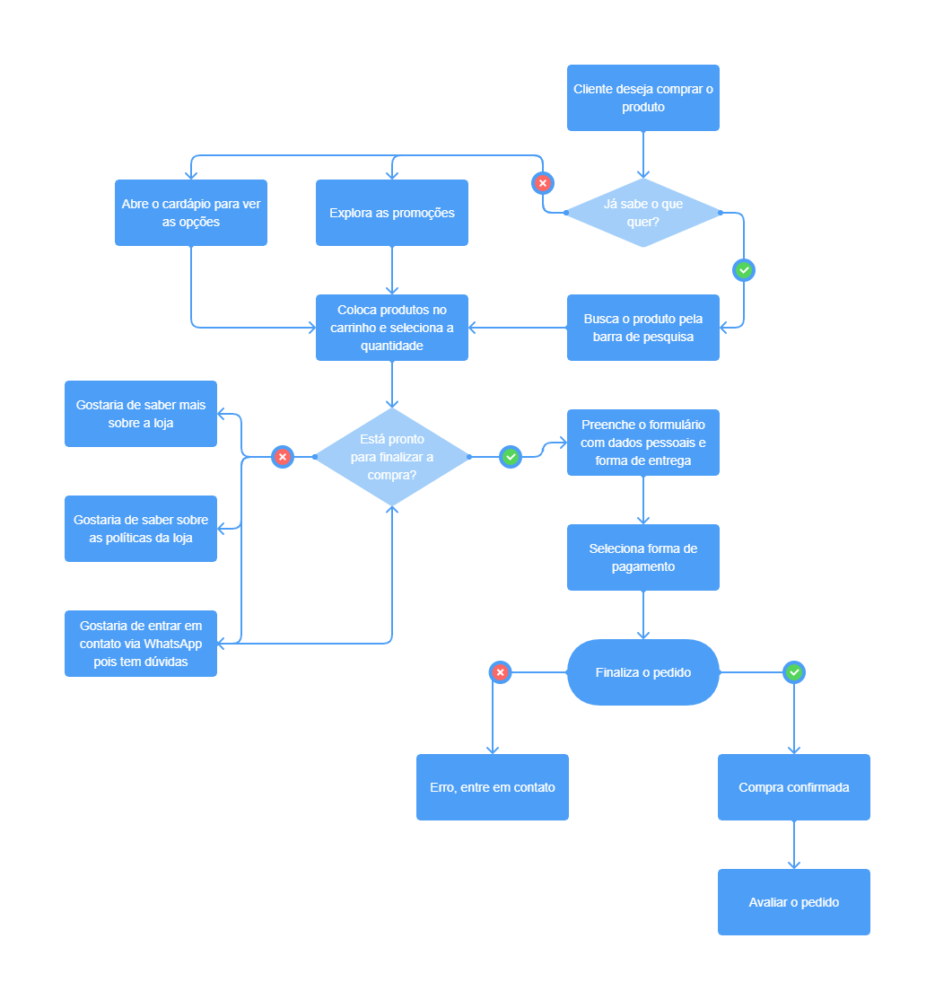

# Projeto de Interface

Pré-requisitos: <a href="2-Especificação do Projeto.md"> Documentação de Especificação</a>
 
O projeto de interface oferece uma visão geral da interação do usuário no site, e com o protótipo das telas com suas funcionalidades (wireframes) mostra o início da definição de layout. As telas foram pensadas considerando a agilidade, acessibilidade, usabilidade e estabelece uma identidade visual padronizada para desktops e dispositivos móveis.

## User Flow

O user flow tem como objetivo mapear o fluxo de telas que o usuário pode percorrer ao interagir com o site. Foi elaborado para atender aos requisitos funcionais, não funcionais e as histórias de usuário abordados na <a href="2-Especificação do Projeto.md"> Documentação de Especificação</a>. 

## Wireframes

As telas do site são apresentadas em detalhes nos itens que se seguem e apresentam elementos fundamentais do layout. As telas apresentam uma estrutura comum que é apresentada na Figura X. Nesta estrutura, existem 3 grandes blocos, descritos a seguir. São eles: 

<b>Cabeçalho</b> - local onde são dispostos elementos fixos de identidade (logo) e navegação principal do site (menu); 

<b>Conteúdo</b> - apresenta o conteúdo da tela em questão; 

<b>Rodapé</b> - apresenta dados de copyright e mais detalhes sobre o site. 

