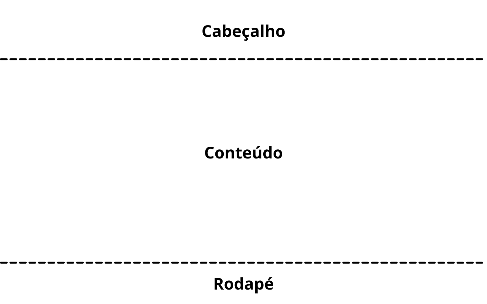
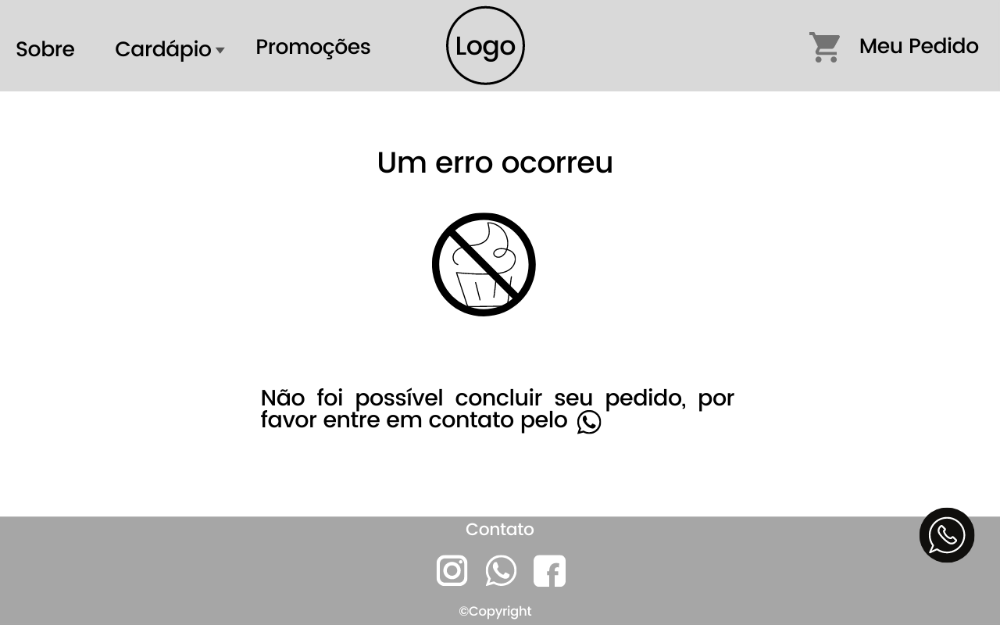

# Projeto de Interface

Pré-requisitos: <a href="2-Especificação do Projeto.md"> Documentação de Especificação</a>
 
O projeto de interface oferece uma visão geral da interação do usuário no site. Com o protótipo das telas com suas funcionalidades (wireframes) é possível ver o início da definição de layout. As telas foram pensadas considerando a agilidade, acessibilidade, usabilidade e estabelece uma identidade visual padronizada para desktops e dispositivos móveis.

## User Flow

O user flow tem como objetivo mapear o fluxo de telas que o usuário pode percorrer ao interagir com o site. Foi elaborado para atender aos requisitos funcionais, não funcionais e as histórias de usuário abordados na <a href="2-Especificação do Projeto.md"> Documentação de Especificação</a>. 

## Wireframes

As telas do site são apresentadas em detalhes nos itens que se seguem e apresentam elementos fundamentais do layout. As telas apresentam uma estrutura comum que é apresentada na Figura X. Nesta estrutura, existem 3 grandes blocos, descritos a seguir. São eles: 

<b>Cabeçalho</b> - local onde são dispostos elementos fixos de identidade (logo) e navegação principal do site (menu); 

<b>Conteúdo</b> - apresenta o conteúdo da tela em questão; 

<b>Rodapé</b> - apresenta dados de copyright e mais detalhes sobre o site. 

E por fim, um botão, presente em todas as páginas, que direciona o cliente automaticamente para o Whatsapp da empresa.

## Tela - Home-page

Sendo a página inicial do site, a home-page, ou cardápio, com base na estrutura padrão, possui:
 
<b>Cabeçalho</b> - com menu de navegação para as páginas sobre, cardápio, contato e carrinho de compras. 

<b>Bloco de Conteúdo</b> - com espaço de destaque para itens promocionais e comemorativos, um espaço para pesquisa e filtro de produtos, e uma lista de produtos separados por categorias.

<b>Rodapé</b> - com link para as políticas da empresa, e informações sobre endereço, métodos de pagamento, redes sociais e copyright.

## Tela - Sobre

Apresenta informações sobre a empresa, sua missão, valores e endereço.

## Tela - Políticas

Apresentas as políticas gerais da empresa quanto a entrega, trocas e devoluções, pagamentos a privacidade.

## Tela - Contato

Oferece informações sobre redes sociais da loja e telefone.

## Tela - Resultado da Busca

Em seu bloco de conteúdo apresenta uma lista de produtos relacionados, com suas respectivas imagens e valores, que foram selecionados por meio de comandos digitados na barra de pesquisa. É possível adicionar produtos ao carrinho por meio dessa página.

## Tela - Produtos

Mostra os produtos inclusos em uma das categorias principais apresentadas na home-page e segue o padrão da tela de Resultado da Busca. Também é possível adicionar produtos ao carrinho por meio dessa página.

## Tela - Descrição do Produto

Acessada ao clicar em um produto incluso nas telas de produto ou resultado, a página apresenta detalhes sobre os produtos como descrição, ingredientes, avaliação e disponibilidade. Também é possível adicionar produtos ao carrinho por meio dessa página.

## Tela - Carrinho

Espaço onde é apresentado os produtos selecionados, seus valores e quantidades. Também contém os formulários para o cliente preencher com seus dados pessoais (nome e telefone), endereço, preferencias de entrega e pagamento, além de um campo para anotar alguma observação adicional ao pedido, e por fim, o botão para finalizar pedido. 

## Tela - Compra Confirmada

Tela informativa que avisa ao cliente que a compra foi confirmada e reconhecida pelo sistema.

## Tela - Avaliação 

Permite ao ciente avaliar o produto por meio de classificação por estrelas e comentários.

## Tela Erro 

Tela informativa que avisa ao cliente que ocorreu um erro durante a compra e solicita que o cliente entre em contato.

