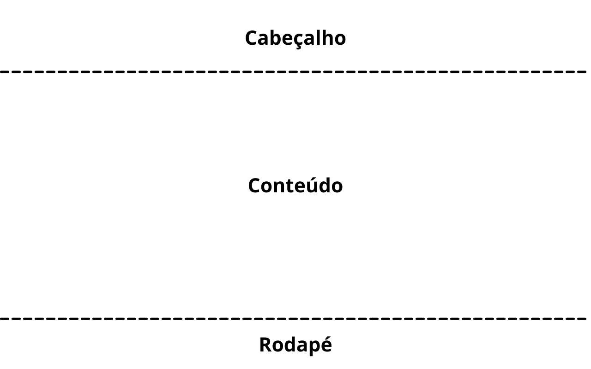
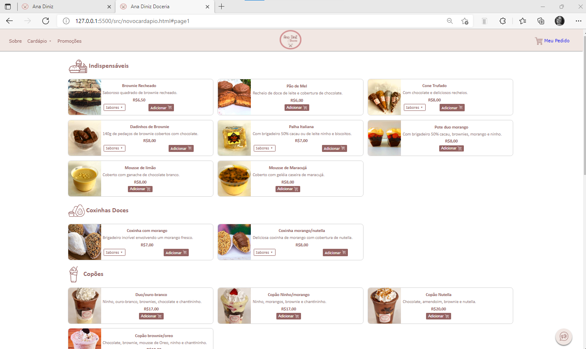
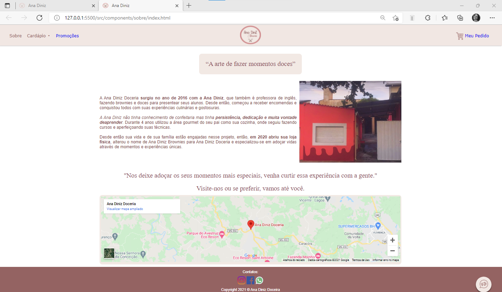
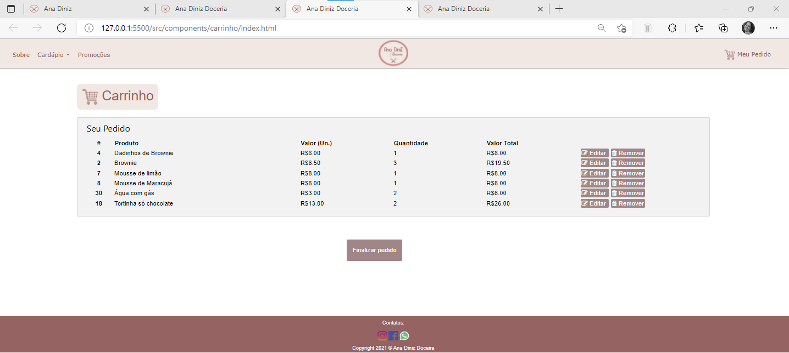

# Template padrão do site

O padrão de layout a ser utilizado pelo site tem correspondência ao projeto de Interface elaborado anteriormente, conforme Figura 30. 

|  | 
|:--:| 
| **Figura 30: Template padrão do site** |
 
 
O template está disponível no site https://www.canva.com/design/DAEsGDEYoM8/share/preview?token=neXWVcScDJBUGIZeIg39zA&role=EDITOR&utm_content=DAEsGDEYoM8&utm_campaign=designshare&utm_medium=link&utm_source=sharebutton e é composto pelos seguintes layouts:  

- Tela principal 

- Tela Cardápio 

- Tela Sobre 
- Tela Meu pedido/carrinho

A responsividade segue o padrão do Bootstrap 

## Tela Principal 
Tela que abrange todas as visualizações iniciais do site, as opções Sobre, Cardápio, Promoções, Carrinho (Meu Pedido), Links para redes sociais como Facebook, Instagram e WhatsApp.

|  | 
|:--:| 
| **Figura 31: Tela inicial** |

## Tela Cardápio
Layout com a exibição do cardápio com a divisão de categorias de produtos: Indispensáveis, Coxinhas Doces, Copões, Tortinhas, Salgados e Bebidas.

|  | 
|:--:| 
| **Figura 32: Tela Cardápio** |

## Tela Sobre
Tela sobre a trajetória da loja

|  | 
|:--:| 
| **Figura 33: Tela Sobre** |
 
 ## Tela Meu Pedido/Carrinho
 Tela do pedido de compra, demonstra produtos, valores unitários, quantidade e valor total. Além da possibilidade de adicionar produtos.

|  | 
|:--:| 
| **Figura 34: Tela Carrinho/Pedido** |
