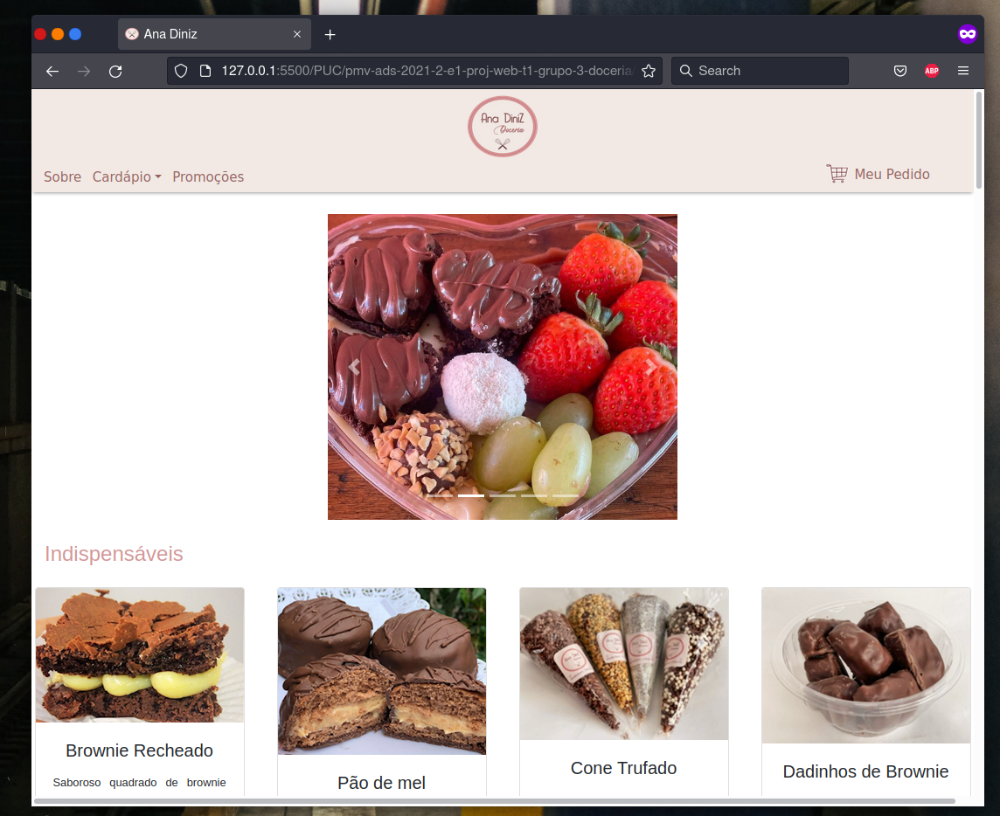
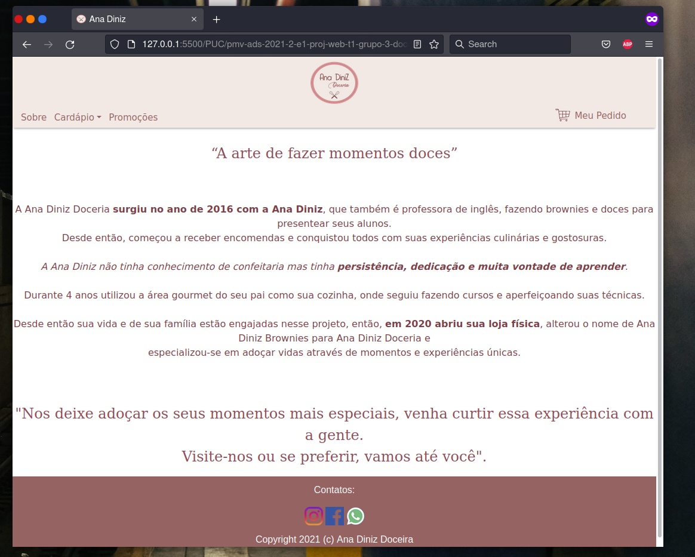
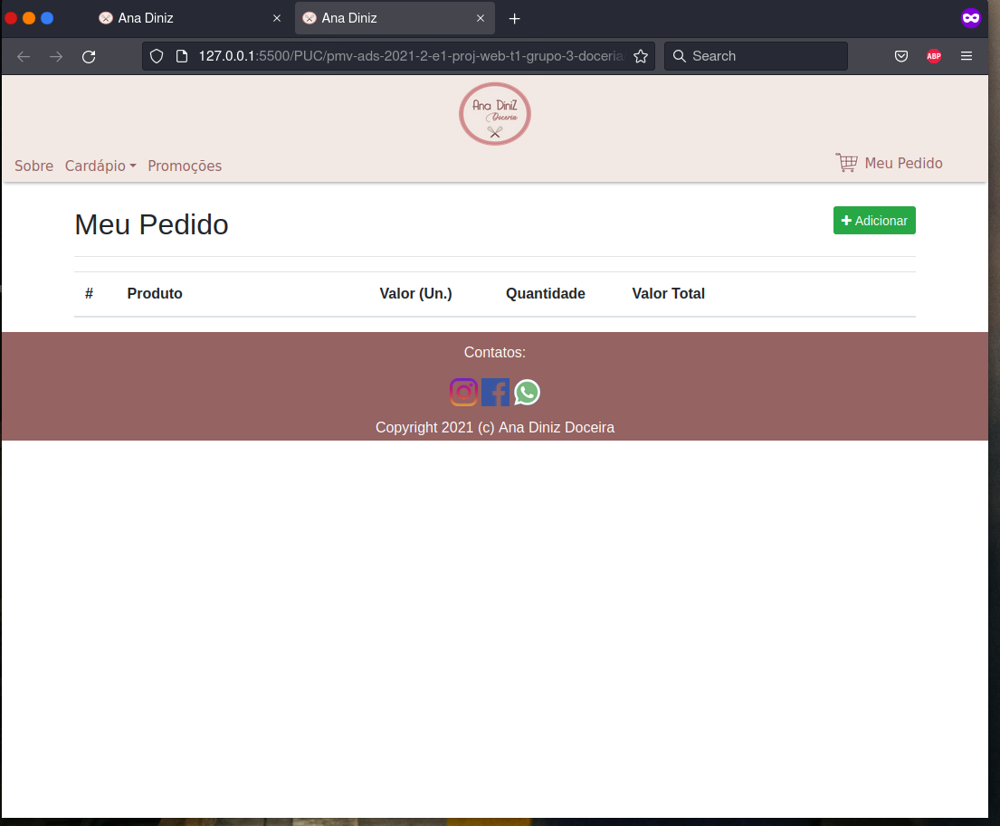

# Programação de Funcionalidades

Nesta seção são apresentadas as telas desenvolvidas para cada uma das funcionalidades do sistema. O respectivo endereço (URL) e outras orientações de acesso são  apresentadas na sequência. 

## Tela inicial/Cardápio/Sobre/Carrinho (RF-01, RF-04, RF-08 e RNF-04) 

A tela principal do sistema apresenta um cabeçalho que direciona para as telas sobre e carrinho, e um botão com as categorias do cardápio. Em seguida, no corpo da página, estão o carrossel e cardápio. Por fim, está o rodapé com as redes socias e formas de contato. Alguns exemplos das telas são apresentadas nas Figuras abaixo.

|  | 
|:--:| 
| **Figura 35: Tela inicial/cardápio** |

|  | 
|:--:| 
| **Figura 36: Tela sobre** |

|  | 
|:--:| 
| **Figura 37: Tela meu pedido** |

 
Para cada requisito funcional, pode ser entregue um artefato desse tipo.
 

__*Requisitos atendidos*__

  - RF-01 -  

  - RF-04 -  

  - RF-08- 
  - RNF - 04 -

 

__*Artefatos da funcionalidade*__

  - index.html 

  - style.css 

  - logo.png 

  - carrinho.png 
  - style-cardapio.css
  - favicon-16x16.png
  - script.js
  - .../src/images/imgcarrosel
  - .../src/images/imgprodutos
  - .../src/componentes/sobre
  - .../src/componentes/carrinho
  

__*Estrutura de Dados*__

__*Instruções de acesso*__

  1. Faça o download do arquivo do projeto (ZIP) ou clone do projeto no GitHub;
  2. Descompacte o arquivo em uma pasta específica;
  3. Abra o Visual Studio Code e execute o Live Server;
  4. Ou, abra um navegador de internet e informe a URL: http://localhost:5500/index.html

## Tela inicial/Cardápio/Sobre (RF-01, RF-04 e RF-08) 

**Checklist dos requisitos:** 

Cada requisito será revisado por pares, com objetivo de identificar erros/conflitos. Ou seja, um par com expertise igual ou superior avalia o artefato (resultado da atividade) objetivamente de acordo com o seguinte quadro: 

|   Atributo  |  Definição |    Sim    |  Não  | Não se aplica |
| :---:         |     :---:      |          :---: |  :---:  | :---: |
| Completo   | O requisito está especificado de forma completa e que pode ser implementado?      |      |     |    |
| Correto   | O requisito reflete o que o cliente solicitou?      |     |     |     |
| Único   | O requisito descreve uma única capacidade, característica, restrição ou atributo de qualidade?      |     |     |     |
| Viável  | O atributo é viável técnica e financeiramente ao ser implementado?      |    |     |     |
| Necessário   | O requisito tem algum motivo para existir?      |     |     |     |
| Priorizado   | O requisito tem prioridade atribuída?     |     |     |     |
| Não Ambíguo   | O requisito não contém ambiguidades que levem os stakeholders a interpretá-lo de forma diferente?     |     |     |     |
| Verificável   | O requisito é possível de ser verificado posteriormente quanto à sua implementação?      |     |     |     |

Quadro 2: Checklist de requisitos

