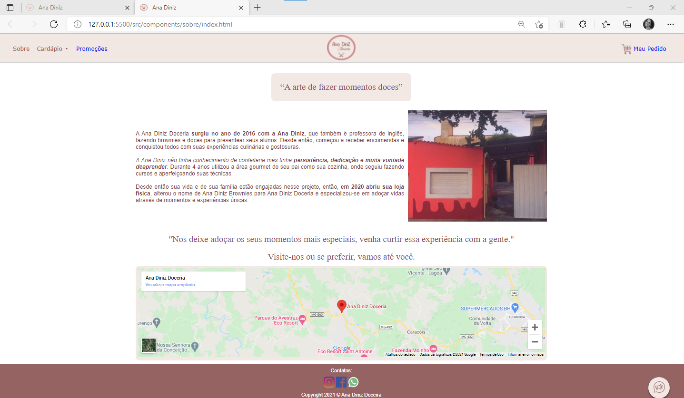
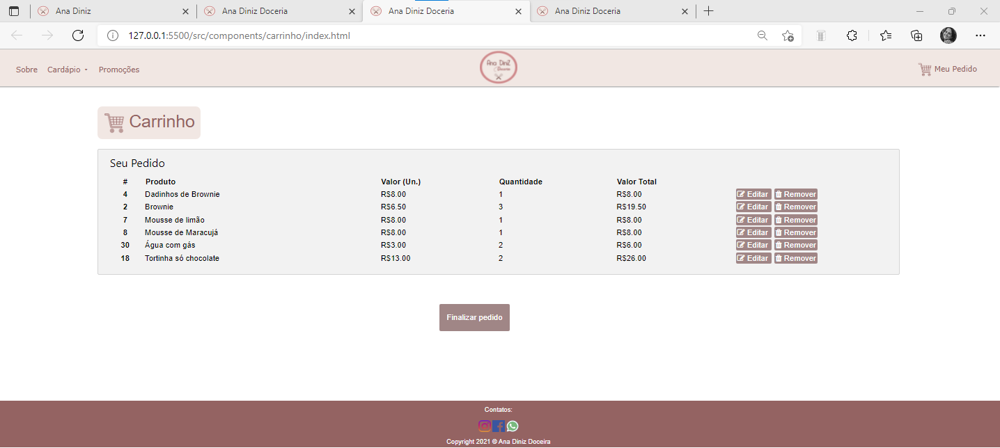

# Programação de Funcionalidades

Nesta seção são apresentadas as telas desenvolvidas para cada uma das funcionalidades do sistema. O respectivo endereço (URL) e outras orientações de acesso são  apresentadas na sequência. 

## Tela inicial/Cardápio/Sobre/Carrinho (RF-01, RF-04, RNF-01, RNF-02, RNF-03, RNF-04, RE-02, RE-03) 

A tela principal do sistema apresenta um cabeçalho que direciona para as telas sobre,cardápio, promoções e carrinho. No corpo da página, apresenta-se o carrossel com imagens de alguns  produtos e ícones com as categorias dos produtos apresentados no cardápio. Ao clicar em qualquer ícone o cliente é direcionado ao produto, sua descrição e opção de compra. Por fim, consta o rodapé com as redes socias, formas de contato e Copyright, além de um menu flutuante à direita com as redes sociais. Alguns exemplos da tela são apresentadas nas Figuras abaixo.

|  | 
|:--:| 
| **Figura 35: Tela inicial/principal** |

|  | 
|:--:| 
| **Figura 36: Tela Inicial/flutuante** |

 
Para cada requisito funcional, pode ser entregue um artefato desse tipo.
 

__*Requisitos atendidos*__

  - RF-01   

  - RF-04 
 
  - RNF-01
  - RNF-02
  - RNF-03
  - RNF-04
  - RE-02
  - RE-03

 

__*Artefatos da funcionalidade*__

  - index.html 

   - novo-style-index.css 

  - logo.png 

  - carrinho.png 
  - novo-style-cardapio.css
  - favicon-16x16.png
  - script.js
  - .../src/images/imgcarrosel
  - .../src/images/imgprodutos
 
  - .../src/componentes/carrinho

## Tela Sobre (RF-01, RF-04, RNF-01, RNF-02, RNF-03, RNF-04, RE-02, RE-03) 

A tela Sobre do sistema apresenta um breve histórico da trajetória da Ana Diniz Doceria, além da foto do local e localização no Google Maps.
  
 | 
|:--:| 
| **Figura 37: Tela Sobre** |

 
Para cada requisito funcional, pode ser entregue um artefato desse tipo.
 

__*Requisitos atendidos*__

 - RF-01 -
 - RF-04 - 
 - RNF-01 -
 - RNF-02 -
 - RNF-03 -
 - RNF-04 -
 - RE-02 -
 - RE-03

 
__*Artefatos da funcionalidade*__

 - .../src/componentes/sobre

## Tela Cardápio (RF-01, RF-07, RF-08, RF-09, RNF-01, RNF-02, RNF-03, RNF-04, RE-02, RE-03) 

A tela Cardápio do sistema apresenta os produtos da Doceria, a descrição dos mesmos e sabores. O cardápio destá categorizado conforme solicitação do cliente, o que permite que seus produtos sejam ordenados e delimitados por tipo de produto, além de ter a opção de selecionar o sabor de um determinado produto e adicioná-lo ao carrinho/pedido de compra.
  
 | 
|:--:| 
| **Figura 38: Tela Cardápio** |

 | 
|:--:| 
| **Figura 39: Tela Categoria - Cardápio** |

 
Para cada requisito funcional, pode ser entregue um artefato desse tipo.
 

__*Requisitos atendidos*__

 - RF-01-
 - RF-07-
 - RF-08-
 - RF-09-
 - RNF-01-
 - RNF-02-
 - RNF-03-
 - RNF-04-
 - RE-02-
 - RE-03

 
__*Artefatos da funcionalidade*__

  - index.html 

  - novo-style-index.css 

  - logo.png 
  - novocardapio.html
  - carrinho.png 
  - favicon-16x16.png
  - script.js
  - novo-style-cardapio.css
  - .../src/images/imgcarrosel
  - .../src/images/imgprodutos

## Tela Promoções (RF-01, RF-04, RNF-01, RNF-02, RNF-03, RNF-04, RE-02, RE-03) 

A tela Promoções do sistema atende principalmente o requisito funcional 04, na qual as datas Comemorativas e Promoções ganham destaque e relevância.
  
 | 
|:--:| 
| **Figura 40: Tela Promoções** |

 
Para cada requisito funcional, pode ser entregue um artefato desse tipo.
 

__*Requisitos atendidos*__

- RF-01-
- RF-04-
- RNF-01-
- RNF-02-
- RNF-03-
- RNF-04-
- RE-02-
- RE-03

 
__*Artefatos da funcionalidade*__

- .../src/images/promocoes

## Tela Meu Pedido/Carrinho (RF-01, RF-02, RF-03, RF-05, RF-06, RF10, RF-11, RNF-01, RNF-02, RNF-03, RNF-04, RNF-05, RE-02, RE-03) 

A tela Meu Pedido/Carrinho do sistema é a que atende a maioria dos requisitos, os produtos escolhidos são adicionados à tela meu carrinho, a qual permite o cliente editar e remover o produto. Além disso, ao finalizar o pedido são solicitados, Dados Pessoais como nome e telefone; Dados de Entrega como Opção de Entrega e Retirada, além do endereço se a opção for entrega, o qual utilizou-se integração da API Cep para facilitar preenchimento de formulário; Taxa de frete; Escolha de forma de pagamento (obs.: não utilizou-se API de integração por opção do cliente) e Opção de envio de Mensagem e Observação. Além dos botões de Limpar (limpa o formulário), Salvar (salva o que foi preenchido), Continuar comprando (volta à página principal) e Enviar Pedido, o qual possui uma API de integração com o WhatsApp que envia as informações do formulário para o whatsApp da doceria. cumprindo assim com os requisitos funcionais 2, 3, 5, 6, 11 e 12, preservando a LGPD.
  
 | 
|:--:| 
| **Figura 41: Tela Meu Carrinho** |

 | 
|:--:| 
| **Figura 42: Tela FormulárioPedido** |

 
Para cada requisito funcional, pode ser entregue um artefato desse tipo.
 

__*Requisitos atendidos*__

- RF-01-
- RF-02-
- RF-03-
- RF-05-
- RF-06-
- RF10-
- RF-11-
- RNF-01-
- RNF-02-
- RNF-03-
- RNF-04-
- RNF-05-
- RE-02-
- RE-03-
 
__*Artefatos da funcionalidade*__

  - .../src/componentes/carrinho

__*Estrutura do Documento*__

A estrutura do documento completa está inserida na pasta src do repositório. 

|  | 
|:--:| 
| **Figura 38: Estrutura do documento** |

__*Instruções de acesso*__

  1. Faça o download do arquivo do projeto (ZIP) ou clone do projeto no GitHub;
  2. Descompacte o arquivo em uma pasta específica;
  3. Abra o Visual Studio Code e execute o Live Server;
  4. Ou, abra um navegador de internet e informe a URL: https://icei-puc-minas-pmv-ads.github.io/pmv-ads-2021-2-e1-proj-web-t1-grupo-3-doceria/src/ e http://doceria-ana-diniz.herokuapp.com/

**Checklist dos requisitos:** 

Cada requisito será revisado por pares, com objetivo de identificar erros/conflitos. Ou seja, um par com expertise igual ou superior avalia o artefato (resultado da atividade) objetivamente de acordo com o seguinte quadro: 

|   Atributo  |  Definição |    Sim    |  Não  | Não se aplica |
| :---:         |     :---:      |          :---: |  :---:  | :---: |
| Completo   | O requisito está especificado de forma completa e que pode ser implementado?      |      |     |    |
| Correto   | O requisito reflete o que o cliente solicitou?      |     |     |     |
| Único   | O requisito descreve uma única capacidade, característica, restrição ou atributo de qualidade?      |     |     |     |
| Viável  | O atributo é viável técnica e financeiramente ao ser implementado?      |    |     |     |
| Necessário   | O requisito tem algum motivo para existir?      |     |     |     |
| Priorizado   | O requisito tem prioridade atribuída?     |     |     |     |
| Não Ambíguo   | O requisito não contém ambiguidades que levem os stakeholders a interpretá-lo de forma diferente?     |     |     |     |
| Verificável   | O requisito é possível de ser verificado posteriormente quanto à sua implementação?      |     |     |     |

Quadro 2: Checklist de requisitos

